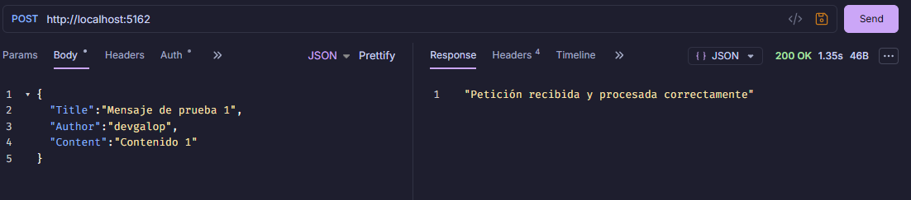
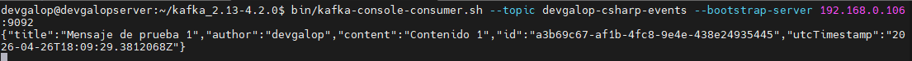
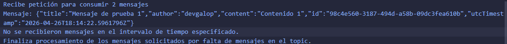
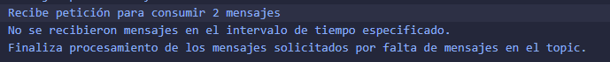

# Resultados de integración .NET con Apache Kafka

En esta sección se presentan los resultados obtenidos tras la integración de una aplicación .NET con Apache Kafka. Se han realizado pruebas para validar el correcto funcionamiento del productor y consumidor de mensajes, así como la comunicación efectiva entre ambos componentes a través de Kafka.

## Publicación de mensajes

Se implementó un endpoint para enviar mensajes a Kafka con el siguiente formato:

```json
{
    "Title": "Sample Title",
    "Author": "John Doe",
    "Content": "This is a sample content for Kafka message."
}
```

Al enviar un mensaje a través del endpoint del productor, se pudo verificar que el mensaje fue correctamente publicado en el topic de Kafka configurado. Se utilizó la herramienta de línea de comandos de Kafka para consumir los mensajes y confirmar que el contenido era el esperado.

- **Consumo Endpoint Productor**: Se validó que el endpoint del productor estaba funcionando correctamente al enviar un mensaje y verificar su publicación en Kafka.


- **Verificación de mensaje en topic de Kafka**: Se utilizó la herramienta de línea de comandos de Kafka para consumir los mensajes publicados y confirmar que el contenido era correcto.


## Consumo de mensajes

Se implementó un endpoint para consumir una cantidad específica de mensajes desde Kafka. Al invocar este endpoint, se pudo verificar que los mensajes fueron correctamente consumidos y procesados por la aplicación .NET. Se validó que el consumidor estaba funcionando correctamente al recibir los mensajes publicados por el productor y procesarlos según la lógica implementada.

- **Consumo Endpoint Consumidor**: Se validó que el endpoint del consumidor estaba funcionando correctamente al invocar el endpoint y verificar que los mensajes fueron consumidos y procesados.


- **Verificación de mensaje consumido**: Se verificó que los mensajes consumidos por el consumidor eran los mismos que fueron publicados por el productor, confirmando la correcta comunicación entre ambos componentes a través de Kafka.


- **Verificación de mensaje cuando no existen mensajes para consumir**: Se validó que el consumidor manejaba correctamente la situación cuando no había mensajes disponibles para consumir, mostrando un mensaje adecuado al usuario.
  
